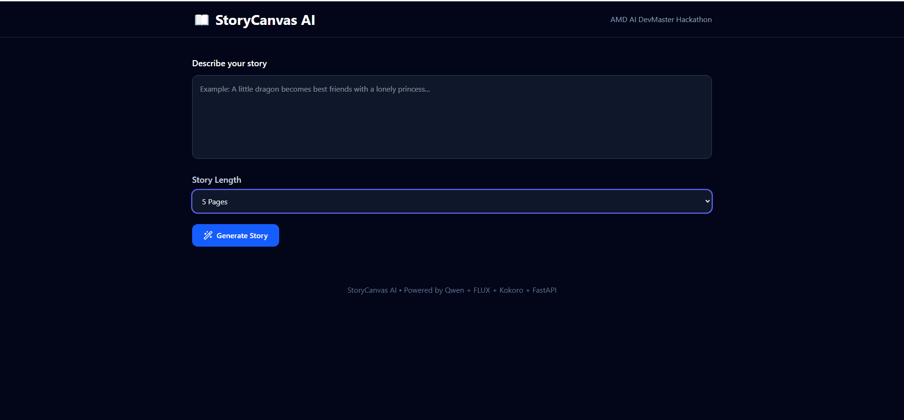
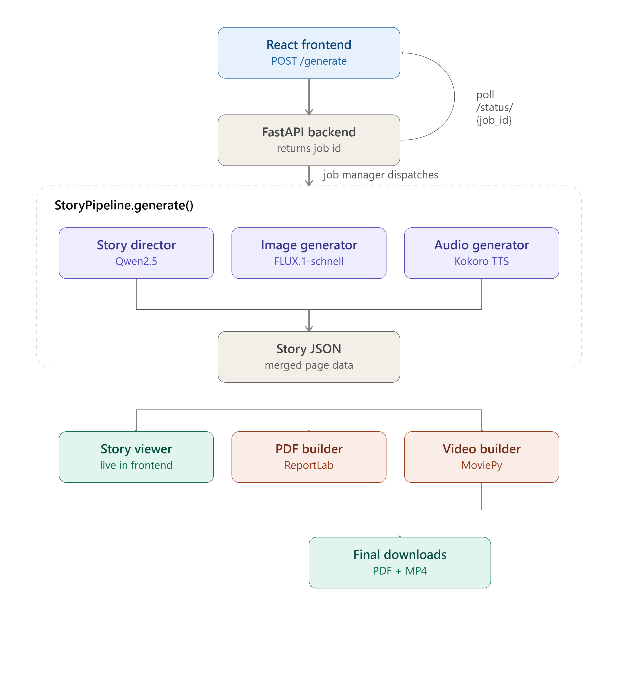

# 📖 StoryCanvas AI
### AI-Powered Multimodal Story Creation Platform
**AMD AI DevMaster Hackathon 2026 – Track 1: Multimodal Content Creation**

---

<p align="center">

Transform a single text prompt into a fully illustrated, narrated digital storybook.

Generate ✍️ Stories → 🎨 AI Illustrations → 🎙️ Narration → 📄 PDF → 🎥 MP4 Video

</p>

---

# Table of Contents

- Overview
- Features
- Demo Workflow
- System Architecture
- AI Pipeline
- Technology Stack
- Project Structure
- AI Models
- AMD Radeon GPU Optimization
- Installation
- Running the Project
- API Endpoints
- Project Workflow
- Output Format
- Performance
- Future Improvements
- Contributors
- License

---

# Overview

StoryCanvas AI is an end-to-end multimodal AI storytelling platform that automatically converts a simple natural language prompt into an interactive digital storybook.

Unlike traditional AI image generators or standalone text generation tools, StoryCanvas AI integrates multiple specialized AI models into one seamless pipeline.

The platform:

- Generates an original story
- Splits it into multiple pages
- Creates an illustration for every page
- Produces high-quality narration
- Displays the story in a modern web interface
- Exports the final result as:
  - PDF Storybook
  - Narrated MP4 Video

The entire pipeline is optimized for AMD Radeon GPUs using ROCm-compatible PyTorch inference.

---



# Features

## AI Story Generation

Generate complete stories from a single sentence.

Example Prompt

> A lonely astronaut discovers a magical forest growing inside an abandoned spaceship.

The system automatically creates:

- Story title
- Genre
- Multiple pages
- Consistent storyline

---

## AI Illustration Generation

Every story page receives its own AI-generated illustration using FLUX.

Features:

- High-quality artwork
- Prompt-based image generation
- Automatic page consistency
- PNG output

---

## AI Narration

Every page is converted into natural speech using Kokoro TTS.

Features

- High-quality speech synthesis
- WAV output
- Browser playback
- Video narration support

---

## Interactive Story Viewer

React frontend displaying

- Story pages
- Illustrations
- Narration
- Responsive layout
- Live generation status

---

## Export Options

Automatically generate

- PDF Storybook
- Narrated MP4 Video

---

## Asynchronous Processing

Large AI models require time.

Instead of waiting several minutes for a single HTTP request, StoryCanvas AI uses asynchronous background jobs.

Benefits

- No browser timeout
- Live progress updates
- Better user experience

---

# Demo Workflow

```text
User Prompt

↓

Generate Story

↓

Illustrate Story

↓

Generate Narration

↓

Build PDF

↓

Build Video

↓

Display Story
```

---

# System Architecture




---

# AI Pipeline

StoryCanvas AI is composed of five major stages.

---

## Stage 1 — Story Generation

Input

```
"A brave rabbit saves an enchanted kingdom."
```

↓

Qwen2.5 generates

- Title
- Genre
- Story pages

Output

```json
{{
    "title":"",
    "genre":"",
    "characters":[
        {{
            "name":"",
            "age":"",
            "gender":"",
            "species":"",
            "hair":"",
            "eyes":"",
            "clothes":"",
            "accessories":"",
            "personality":"",
            "description":""
        }}
    ],
    "pages":[
        {{
            "page":1,
            "story":"",
            "characters":[],
            "image_prompt":""
        }}
    ]
}}
```

---

## Stage 2 — Illustration Generation

Each page is converted into an optimized image prompt.

Example

Story

```
The rabbit enters a glowing forest.
```

↓

Prompt

```
Cute fantasy rabbit walking through a magical glowing forest,
storybook illustration,
soft lighting,
children's book,
high quality
```

↓

FLUX generates

```
page_1.png
```

---

## Stage 3 — Narration

Every story page is sent to Kokoro.

Output

```
page_1.wav
page_2.wav
...
```

---

## Stage 4 — PDF Generation

ReportLab compiles

- Title
- Images
- Story text

into

```
story.pdf
```

---

## Stage 5 — Video Generation

MoviePy combines

Images

+

Narration

↓

MP4 Storybook

---

# Technology Stack

## Frontend

- React
- Vite
- TailwindCSS
- Axios

---

## Backend

- FastAPI
- Uvicorn
- Python 3.11

---

## AI Frameworks

- PyTorch
- HuggingFace Transformers
- Diffusers

---

## AI Models

| Task | Model |
|------|------|
| Story Generation | Qwen2.5 |
| Image Generation | FLUX.1-schnell |
| Text-to-Speech | Kokoro |

---

## Media Processing

- Pillow
- MoviePy
- ReportLab

---

# Project Structure

```
StoryCanvasAI/
│
├── backend/
│   │
│   ├── api/
│   │   ├── app.py
│   │   ├── routes.py
│   │   └── jobs.py
│   │
│   ├── models/
│   │   └── schemas.py
│   │
│   ├── pipeline/
│   │   └── story_pipeline.py
│   │
│   ├── story_engine/
│   │   ├── director.py
│   │   └── story_parser.py
│   │
│   ├── image_engine/
│   │   └── image_generator.py
│   │
│   ├── audio_engine/
│   │   └── audio_generator.py
│   │
│   ├── pdf_engine/
│   │   └── pdf_builder.py
│   │
│   ├── video_engine/
│   │   └── video_builder.py
│   │
│   ├── prompts/
│   │   └── story_prompt.py
│   │
│   ├── services/
│   │   ├── qwen.py
│   │   ├── flux.py
│   │   └── kokoro.py
│   │
│   ├── generated/
│   │   ├── images/
│   │   ├── audio/
│   │   ├── pdf/
│   │   ├── video/
│   │   └── stories/
│   │       └── story.json
│   │
│   ├── requirements.txt
│   ├── Dockerfile
│   └── __init__.py
│
├── frontend/
│   │
│   ├── public/
│   │
│   ├── src/
│   │   │
│   │   ├── assets/
│   │   │
│   │   ├── components/
│   │   │   ├── AudioPlayer.jsx
│   │   │   ├── DownloadPanel.jsx
│   │   │   ├── Footer.jsx
│   │   │   ├── GenerateButton.jsx
│   │   │   ├── LoadingScreen.jsx
│   │   │   ├── Navbar.jsx
│   │   │   ├── PromptBox.jsx
│   │   │   └── StoryViewer.jsx
│   │   │
│   │   ├── pages/
│   │   │   └── Home.jsx
│   │   │
│   │   ├── services/
│   │   │   └── api.js
│   │   │
│   │   ├── utils/
│   │   │   └── constants.js
│   │   │
│   │   ├── App.jsx
│   │   ├── main.jsx
│   │   └── index.css
│   │
│   ├── package.json
│   ├── vite.config.js
│   └── dist/
│
├── docs/
│   ├── architecture.png
│   ├── workflow.png
│   ├── homepage.png
│   ├── loading.png
│   ├── story-viewer.png
│   ├── pdf-output.png
│   └── video-output.png
│
├── .gitignore
├── LICENSE
└── README.md
```

---

# AMD Radeon GPU Optimization

StoryCanvas AI is specifically designed to leverage AMD Radeon GPUs using ROCm.

Optimizations include

### Persistent Model Loading

All AI models are loaded only once during server startup.

Benefits

- Faster generation
- Reduced latency
- Lower memory fragmentation

---

### FP16 Inference

Models execute in

```
torch.float16
```

Benefits

- Lower VRAM usage

- Faster inference

- Higher throughput

---

### GPU Inference

All AI inference runs directly on GPU.

```
Prompt

↓

GPU

↓

Story

↓

GPU

↓

Images

↓

GPU

↓

Speech
```

CPU is primarily responsible for

- Request handling
- File management
- API communication

---

### Asynchronous Pipeline

Generation runs inside a background thread.

Advantages

- No HTTP timeout

- Responsive UI

- Progress tracking

---

# Installation

## Clone

```bash
git clone https://github.com/USERNAME/StoryCanvasAI.git

cd StoryCanvasAI
```

---

## Backend

```bash
cd backend

pip install -r requirements.txt

uvicorn StoryCanvasAI.backend.app:app --host 127.0.0.1 --port 8000
```

---

## Frontend

```bash
cd frontend

npm install

npm run build
```

---

# Running the Project

Open

```
http://127.0.0.1:8000
```

Enter a prompt

Example

```
A little dragon learns to fly with the help of forest animals.
```

Click

```
Generate Story
```

The system automatically

- generates the story
- creates illustrations
- synthesizes narration
- builds PDF
- builds video

---

# API Endpoints

## Generate Story

```
POST /generate
```

Returns

```json
{
  "job_id":"..."
}
```

---

## Check Status

```
GET /status/{job_id}
```

---

## Retrieve Story

```
GET /story/{job_id}
```

---

## Health Check

```
GET /health
```

---

# Output Structure

```
generated/

images/

page_1.png

page_2.png

audio/

page_1.wav

page_2.wav

pdf/

story.pdf

video/

story.mp4

story.json
```

---

# Performance

Typical workflow

Story Generation

↓

Illustration Generation

↓

Narration

↓

PDF

↓

Video

↓

Completed Storybook

*(Performance values depend on GPU hardware and generation settings. For the hackathon submission, include measured timings and GPU utilization from your AMD Radeon system.)*

---

# Future Improvements

- Character consistency
- Animation generation
- Multiple illustration styles
- Story editing
- Multi-language narration
- Cloud deployment
- Story sharing
- Interactive storybooks

---

# Contributors

Team **Sinifive**

**M.Bharath Kumar**

AMD AI DevMaster Hackathon 2026

Track 1 — Multimodal Content Creation

---

# License

MIT License

---

## Acknowledgements

This project uses several outstanding open-source technologies:

- AMD ROCm
- PyTorch
- Hugging Face Transformers
- Diffusers
- FastAPI
- React
- MoviePy
- ReportLab
- Tailwind CSS

Special thanks to the AMD AI DevMaster Hackathon organizers for providing the platform and opportunity to build innovative multimodal AI applications.
