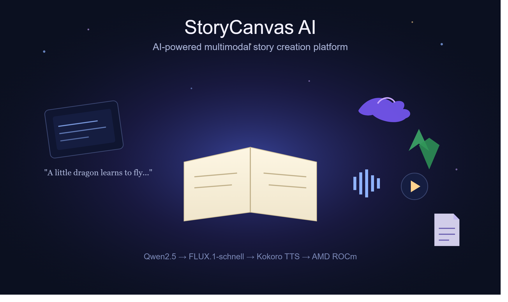

<p align="center">
  
</p>
<h1 align="center">📖 StoryCanvas AI</h1>
<h3 align="center">AI-Powered Multimodal Story Creation Platform</h3>
<p align="center"><b>AMD AI DevMaster Hackathon 2026 — Track 1: Multimodal Content Creation</b></p>
<p align="center">
  
  
  
  
  
  
</p>
<p align="center">
  <b>Prompt → Story → Illustrations → Narration → PDF → MP4 — one pipeline, one GPU.</b>
</p>
---
 
## Table of Contents
 
1. [Overview](#1-overview)
2. [Target Users & Practical Impact](#2-target-users--practical-impact)
3. [Features](#3-features)
4. [System Architecture](#4-system-architecture)
5. [AI Pipeline — Stage by Stage](#5-ai-pipeline--stage-by-stage)
6. [AI Models](#6-ai-models)
7. [Technology Stack](#7-technology-stack)
8. [AMD Radeon GPU / ROCm Optimization](#8-amd-radeon-gpu--rocm-optimization)
9. [Performance Benchmarks](#9-performance-benchmarks)
10. [Project Structure](#10-project-structure)
11. [Installation](#11-installation)
12. [Running the Project](#12-running-the-project)
13. [Troubleshooting](#13-troubleshooting)
14. [API Reference](#14-api-reference)
15. [Output Structure](#15-output-structure)
16. [Future Scope](#16-future-scope)
17. [Contributors](#17-contributors)
18. [License & Acknowledgements](#18-license--acknowledgements)
---
 
## 1. Overview
 
StoryCanvas AI is an end-to-end multimodal AI storytelling platform that transforms a single natural-language prompt into a complete, illustrated, and narrated digital storybook — with no manual writing, drawing, recording, or editing required.
 
Unlike standalone text generators or image models, StoryCanvas AI orchestrates **three specialized AI models** inside one asynchronous pipeline:
 
| Stage | What Happens |
|---|---|
| 1 | User submits a one-line story prompt |
| 2 | **Qwen2.5** generates a structured, multi-page story (title, genre, characters, pages) |
| 3 | **FLUX.1-schnell** illustrates every page individually |
| 4 | **Kokoro TTS** narrates every page as natural speech |
| 5 | Everything is compiled into a **PDF storybook** and a **narrated MP4 video** |
| 6 | The React frontend displays it all live, with download links |
 
The entire inference pipeline — story generation, image synthesis, and speech synthesis — runs on **AMD Radeon GPUs via ROCm-compatible PyTorch**, with persistent model loading and FP16 inference to keep latency low.
 
---
 
## 2. Target Users & Practical Impact
 
| Target User | Use Case |
|---|---|
| **Educators** | Classroom stories, learning materials, interactive lessons |
| **Parents & Guardians** | Personalized bedtime stories for kids |
| **Children's Authors** | Rapid story/scene prototyping before publication |
| **Content Creators** | Multimedia storytelling for blogs, social, and educational platforms |
| **Educational Institutions** | Accessible digital learning resources combining text, image, and speech |
 
**Why it matters:** producing an illustrated, narrated storybook traditionally requires a writer, an illustrator, a voice artist, and editing software — hours or days of work. StoryCanvas AI compresses that into a single prompt and a **72-second GPU pipeline** (see [§9](#9-performance-benchmarks)), while also improving accessibility for visually impaired readers via built-in narration.
 
---
 
## 3. Features
 
### AI Story Generation
Generates a full structured story — title, genre, characters, and page-by-page narrative — from one sentence.
 
```
Prompt: "A lonely astronaut discovers a magical forest growing inside an abandoned spaceship."
```
 
### AI Illustration Generation
Every page gets its own FLUX.1-schnell illustration, generated from an auto-derived, page-specific image prompt. PNG output, one image per page.
 
### AI Narration
Every page is converted to natural speech via Kokoro TTS. WAV output per page, playable in-browser and muxed into the final video.
 
### Interactive Story Viewer
React frontend for reading pages, viewing art, playing narration, and tracking live generation progress.
 
### Export Options
- 📄 Printable **PDF storybook** (ReportLab)
- 🎥 Narrated **MP4 video** (MoviePy) — images auto-timed to narration length
### Asynchronous Processing
Story generation can take over a minute of GPU inference. Rather than blocking on a single HTTP request, the backend spins up a background job, returns a `job_id` immediately, and the frontend polls `/status/{job_id}` for live progress — no browser timeouts, no frozen UI.
 
---
 
## 4. System Architecture
 
```
React frontend  ──POST /generate──▶  FastAPI backend ──returns job_id──▶ (frontend polls /status/{job_id})
                                            │
                                            ▼ job manager dispatches
                                   ┌────────────────────────┐
                                   │StoryPipeline.generate()│
                                   └────────────────────────┘
                                     │         │         │
                              Story director  Image gen  Audio gen
                                (Qwen2.5)   (FLUX.1-schnell) (Kokoro TTS)
                                     │         │         │
                                     └────┬────┴────┬────┘
                                          ▼          ▼
                                     Story JSON (merged page data)
                                              │
                                ┌─────────────┼──────────────┐
                                ▼             ▼              ▼
                          Story Viewer   PDF builder    Video builder
                         (live in React)  (ReportLab)     (MoviePy)
                                └─────────────┴──────────────┘
                                              ▼
                                    Final downloads: PDF + MP4
```
 
*(See `docs/architecture.png` for the rendered diagram.)*
 
**Layers:**
- **Frontend** — React + Vite + Tailwind CSS. Submits prompts, polls job status, renders the interactive story, exposes download buttons.
- **Backend** — FastAPI. Exposes REST endpoints, owns the Job Manager, serves generated media.
- **AI Processing Layer** — `StoryPipeline` orchestrates the Story Director → Image Generator → Audio Generator sequence, all writing into one shared `Story JSON`.
- **Output Layer** — PDF Builder and Video Builder consume the same `Story JSON` to produce final downloadable assets.
---
 
## 5. AI Pipeline — Stage by Stage
 
### Stage 1 — Story Generation
**Input:**
```
"A brave rabbit saves an enchanted kingdom."
```
**Qwen2.5 generates:**
```json
{
  "title": "",
  "genre": "",
  "characters": [
    {
      "name": "", "age": "", "gender": "", "species": "",
      "hair": "", "eyes": "", "clothes": "", "accessories": "",
      "personality": "", "description": ""
    }
  ],
  "pages": [
    { "page": 1, "story": "", "characters": [], "image_prompt": "" }
  ]
}
```
 
### Stage 2 — Illustration Generation
Each page's narrative is converted into an optimized image prompt, then rendered by FLUX.1-schnell.
 
```
Story:  "The rabbit enters a glowing forest."
Prompt: "Cute fantasy rabbit walking through a magical glowing forest,
         storybook illustration, soft lighting, children's book, high quality"
Output: page_1.png
```
 
### Stage 3 — Narration
Every page's text is sent to Kokoro TTS.
```
Output: page_1.wav, page_2.wav, ...
```
 
### Stage 4 — PDF Generation
ReportLab compiles title + images + story text → `story.pdf`.
 
### Stage 5 — Video Generation
MoviePy combines page images + narration audio, auto-timed per page → `story.mp4`.
 
---
 
## 6. AI Models
 
| Task | Model | Why This Model |
|---|---|---|
| Story Generation | **Qwen2.5** (LLM) | Strong instruction-following, coherent long-form text, produces clean structured JSON for downstream stages |
| Image Generation | **FLUX.1-schnell** | High-quality illustrations in fewer inference steps — good quality/speed/VRAM balance for an interactive app |
| Text-to-Speech | **Kokoro TTS** | Lightweight, low inference overhead, fast synthesis, natural-sounding continuous narration |
 
All three models are open-weight, run locally, and are ROCm-compatible — no closed-source API calls for any core function.
 
---
 
## 7. Technology Stack
 
| Layer | Technology |
|---|---|
| Frontend | React, Vite, Tailwind CSS, Axios |
| Backend | FastAPI, Uvicorn, Python 3.11 |
| AI Frameworks | PyTorch (ROCm build), Hugging Face Transformers, Diffusers |
| Media Processing | Pillow, MoviePy, ReportLab |
| GPU Runtime | ROCm |
 
---
 
## 8. AMD Radeon GPU / ROCm Optimization
 
| Technique | Implementation | Benefit |
|---|---|---|
| **ROCm GPU acceleration** | All three models run through ROCm-enabled PyTorch | Offloads inference from CPU → AMD Radeon GPU |
| **Persistent model loading** | Models load once at startup, stay resident in GPU memory | Eliminates reload overhead on every request |
| **FP16 half-precision** | Supported models run in `torch.float16` | Lower VRAM footprint, higher throughput |
| **Asynchronous pipeline** | Generation runs as a FastAPI background job | No HTTP timeouts, responsive UI, live progress |
| **GPU-centric inference** | Story, image, and speech generation all run on GPU; CPU handles only request/file I/O | Maximizes GPU utilization, balances CPU/GPU load |
 
```
Prompt → GPU (Qwen2.5) → Story → GPU (FLUX.1-schnell) → Images → GPU (Kokoro) → Speech
```
 
---
 
## 9. Performance Benchmarks
 
Measured on the AMD Radeon Cloud test environment:
 
| Metric | Value |
|---|---|
| PyTorch Version | 2.9.1+gitff65f5b |
| GPU Platform | AMD Radeon Graphics |
| Available VRAM | 47.98 GB |
| Qwen2.5 Loading Time (FP16) | 25 s |
| FLUX.1-schnell Loading Time (FP16) | 68 s |
| Kokoro TTS Loading Time | 4 s |
| Story Generation Time | 3 s |
| Image Generation Time | 3 s / page |
| Audio Generation Time | 4 s / page |
| Video Generation Time | 62 s |
| **Total Pipeline Execution Time** | **72 s** |
| GPU Memory — Qwen2.5 | 7.29 GB |
| GPU Memory — FLUX.1-schnell | 33.53 GB |
| GPU Memory — Kokoro TTS | 0.86 GB |
| **Total GPU Memory Utilized** | **41.68 GB** |
 
> **Note on footprint:** FLUX.1-schnell's ~33.5 GB reflects full-precision image weights. Planned work (see [§16](#16-future-scope)) includes quantization and memory-efficient attention to shrink this for lighter-VRAM deployments.
 
---
 
## 10. Project Structure
 
```
StoryCanvasAI/
│
├── backend/      
│   ├── api/                #Handles jobs and the api routes
│   │   ├── app.py
│   │   ├── routes.py
│   │   └── jobs.py
│   ├── models/            #It has the defined schema
│   │   └── schemas.py
│   ├── pipeline/          #orchestrator
│   │   └── story_pipeline.py
│   ├── story_engine/
│   │   ├── director.py
│   │   └── story_parser.py
│   ├── image_engine/       #generates images
│   │   └── image_generator.py
│   ├── audio_engine/        #generates audio
│   │   └── audio_generator.py
│   ├── pdf_engine/          #generates pdfs
│   │   └── pdf_builder.py
│   ├── video_engine/        #generates video
│   │   └── video_builder.py
│   ├── prompts/             #predefined prompt
│   │   └── story_prompt.py
│   ├── services/            #Loading of models and generation
│   │   ├── qwen.py
│   │   ├── flux.py
│   │   └── kokoro.py
│   ├── generated/          #generated multimedia is stored in here as per the category
│   │   ├── images/
│   │   ├── audio/
│   │   ├── pdf/
│   │   ├── video/
│   │   └── stories/story.json
│   ├── requirements.txt
│   └── __init__.py
│
├── frontend/
│   ├── public/
│   ├── src/
│   │   ├── assets/
│   │   ├── components/
│   │   │   ├── AudioPlayer.jsx
│   │   │   ├── DownloadPanel.jsx
│   │   │   ├── Footer.jsx
│   │   │   ├── GenerateButton.jsx
│   │   │   ├── LoadingScreen.jsx
│   │   │   ├── Navbar.jsx
│   │   │   ├── PromptBox.jsx
│   │   │   └── StoryViewer.jsx
│   │   ├── pages/Home.jsx
│   │   ├── services/api.js
│   │   ├── utils/constants.js
│   │   ├── App.jsx
│   │   ├── main.jsx
│   │   └── index.css
│   ├── package.json
│   ├── vite.config.js
│   └── dist/
│
├── docs/                  #Samples of the outputs generated
│   ├── banner.png
│   ├── architecture.png
│   ├── Home.png
│   ├── generating.png
│   └── pdf-output.png
│
├── .gitignore
├── Demo_video_StorycanvasAI .mp4
├── StoryCanvas_AI.pptx
├── README.md
└── requirements.txt

```
 
---
 
## 11. Installation
 
### Prerequisites
- AMD Radeon GPU with ROCm 6.x / 7.x support
- Python 3.11 (3.10+ compatible)
- Node.js + npm
- ≥ 40 GB free VRAM recommended (see [§9](#9-performance-benchmarks))
### Clone
```bash
git clone https://github.com/sinifive/StoryCanvasAI.git
cd StoryCanvasAI
```
 
### Backend Setup
```bash
pip install -r requirements.txt
```
 
Verify ROCm is active before running the server:
```bash
python -c "import torch; print(torch.cuda.is_available(), torch.version.hip)"
# expected: True <rocm-version>
```
 
### Frontend Setup
```bash
cd frontend
npm install
npm run build
```
 
---
 
## 12. Running the Project
 
### Start the backend
```bash
uvicorn StoryCanvasAI.backend.app:app --host 127.0.0.1 --port 8000
```
 
### Start the frontend (development mode)
```bash
cd frontend
npm run dev
```
 
### Or serve the production build
Once `npm run build` completes, the backend serves the built frontend directly from `frontend/dist`.
 
Open:
```
http://127.0.0.1:8000
```
 
Enter a prompt, e.g.:
```
A little dragon learns to fly with the help of forest animals.
```
---

### If using RC Tunnel
change
```
export const API_BASE = "http://127.0.0.1:8000";
```
from  frontend/src/utils/constants.js

to 
```
export const API_BASE = "RC TUNNEL URL";
```
and execute npm run build and move to that link
---
Click **Generate Story** — the system will generate the story, illustrate every page, synthesize narration, and build the PDF + MP4 automatically.
 
---
 
## 13. Troubleshooting
 
Common frontend build issues and their fixes, collected from local setup runs:
 
**`vite: command not found` or permission denied on the vite binary**
```bash
ls -l node_modules/.bin/vite      # check current permissions
chmod +x node_modules/.bin/vite   # make it executable
```
 
**Stale or corrupted `node_modules` / lockfile conflicts**
```bash
rm -rf node_modules
rm package-lock.json
npm cache clean --force
npm install
```
 
**After a clean reinstall, rebuild or restart dev server**
```bash
npm run build   # production build
# or
npm run dev     # local dev server with hot reload
```
 
**ROCm GPU not detected (`hipErrorNoBinaryForGpu`)**
On older PyTorch + `gfx1100` cards, you may need:
```bash
export HSA_OVERRIDE_GFX_VERSION=11.0.0
```
 
---
 
## 14. API Reference
 
### Generate Story
```
POST /generate
```
**Response:**
```json
{ "job_id": "..." }
```
 
### Check Job Status
```
GET /status/{job_id}
```
 
### Retrieve Completed Story
```
GET /story/{job_id}
```
 
### Health Check
```
GET /health
```
 
---
 
## 15. Output Structure
 
```
generated/
├── images/
│   ├── page_1.png
│   └── page_2.png
├── audio/
│   ├── page_1.wav
│   └── page_2.wav
├── pdf/
│   └── story.pdf
├── video/
│   └── story.mp4
└── stories/
    └── story.json
```
 
---
 
## 16. Future Scope
 
| Area | Description |
|---|---|
| **Model quantization** | Reduce FLUX.1-schnell's VRAM footprint via quantization / memory-efficient attention |
| **Character consistency** | Reference-guided generation / persistent character embeddings across pages |
| **Multilingual generation** | Extend the LLM pipeline to non-English stories and narration |
| **Interactive story editing** | Regenerate individual pages without recreating the whole story |
| **Animation generation** | Extend static illustrations into short animated clips |
| **Cloud-scale deployment** | Containerized microservices with GPU orchestration for concurrent users |
| **Collaborative storytelling** | Multi-user real-time co-authoring |
| **Mobile app** | Native companion app for on-the-go story generation |
 
---
 
## 17. Contributors
 
**Team Sinifive**
Mallikanti Bharath Kumar
 
AMD AI DevMaster Hackathon 2026 — Track 1: Multimodal Content Creation
 
---
 
## 18. License & Acknowledgements
 
**License:** MIT
 
**Built with:**
AMD ROCm · PyTorch · Hugging Face Transformers · Diffusers · FastAPI · React · MoviePy · ReportLab · Tailwind CSS
 
Special thanks to the AMD AI DevMaster Hackathon organizers for the platform and opportunity to build multimodal AI applications on AMD Radeon GPUs.
